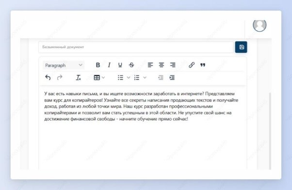

## Рекламные объявления в Яндекс, VK и TenChat

Шаг 1: в шаблонах  в разделе “Маркетинг” выбери необходимую социальную сеть, куда ты собираешься выставить объявление.

Шаг 2: введи название продукта и его описание, а также заполни поле про целевую аудиторию и нажми на кнопку “Создать”.

Объявление для VK:

Объявление для Яндекс для того же продукта:

Рекламное объявление для TenChat снова для того же продукта:

Перед тобой 3 разных текста, которые подстраиваются под особенности определенной социальной сети.
