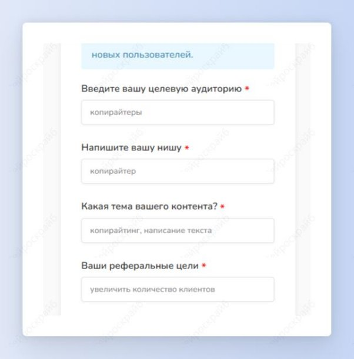
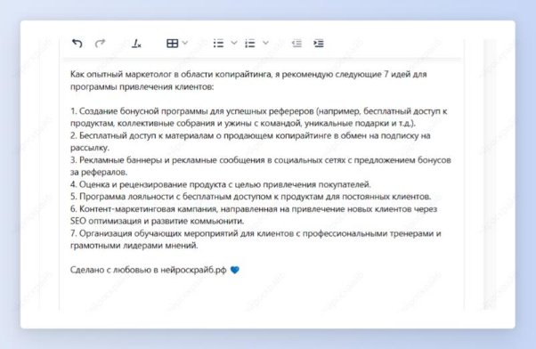

## Идеи партнерских программ

Шаг 1: выбери шаблон “Идеи реферальной программы”.

Шаг 2: введи всю информацию про свою нишу, целевую аудиторию и задачи, которые ты хочешь выполнить с помощью реферальной программы. Нажми на кнопку “Создать”.

Получи несколько идей реферальной программы, которые помогут тебе добиться указанных целей.

