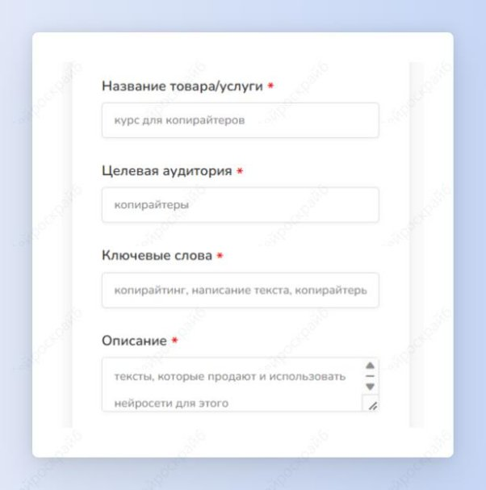
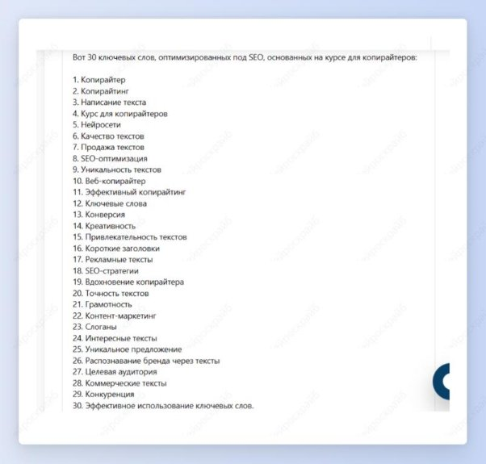

## Поиск ключевых слов продукта

Шаг 1: выбери шаблон “Поиск ключевых слов”.

Шаг 2: введи название своего продукта или услуги, обязательно подробно его опиши, задай целевую аудиторию и введи пару ключевых слов. Нажми на кнопку “Создать”.

Перед тобой 30 ключевых слов, оптимизированных под SEO, основанных на параметрах твоего продукта или услуги.

