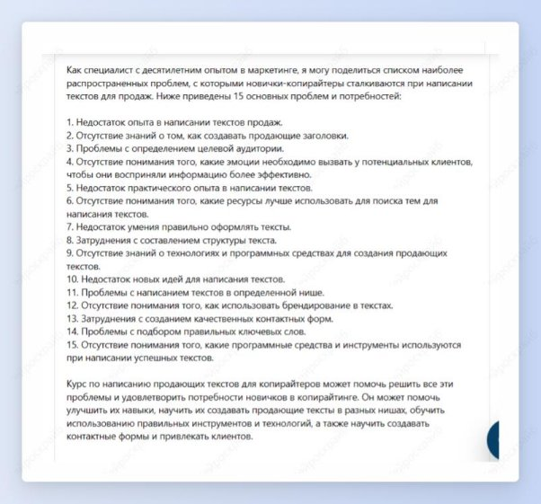

## Проблемы и потребности ЦА
Шаг 1: выбери шаблон “Проблемы и потребности ЦА”.

Шаг 2: опиши целевую аудиторию, нишу и название продукта или услуги. Нажми на кнопку “Создать”.

Получи список проблем и потребностей целевой аудитории в указанной нише.

