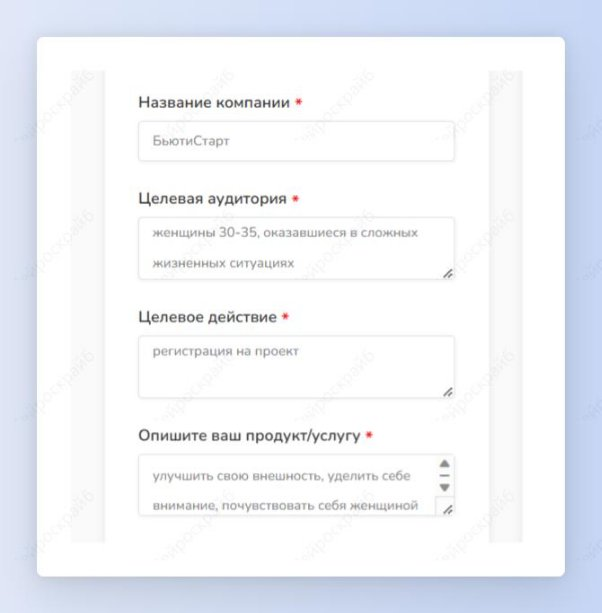
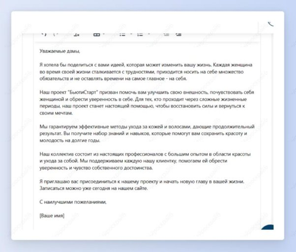

## Холодное письмо для рассылки клиентам

Шаг 1: выбери шаблон “Холодное письмо”.

Шаг 2: заполни все необходимые поля. Нажми на кнопку “Создать”.

Получи текст холодного письма для рассылки потенциальным клиентам.

