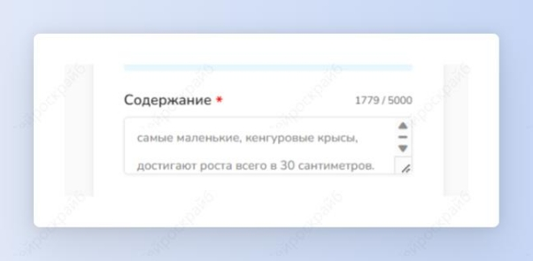
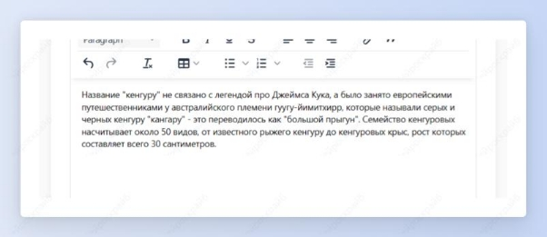

## <a name="_medq3qesoj96">Краткое содержание</a>

Шаг 1: скопируй нужный текст и выбери шаблон “Краткое содержание текста”.

Шаг 2: вставь скопированный текст в нужное поле и нажми на кнопку “Создать”.

Получи краткое содержание текста.

