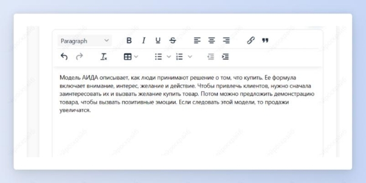

 ## Перефраз текста из сложного в простой

Шаг 1: скопируй сложный текст и выбери шаблон “Резюме для второклассника”.

Шаг 2: вставь скопированный текст. Например, мы взяли объемный текст про модель AIDA [AIDA: 4 этапа принятия решения о покупке, где и как применять | Unisender](https://www.unisender.com/ru/glossary/chto-takoe-aida/?ysclid=lhgvc294ic1701946).

Получи простое и короткое изложение большого и сложного текста.

