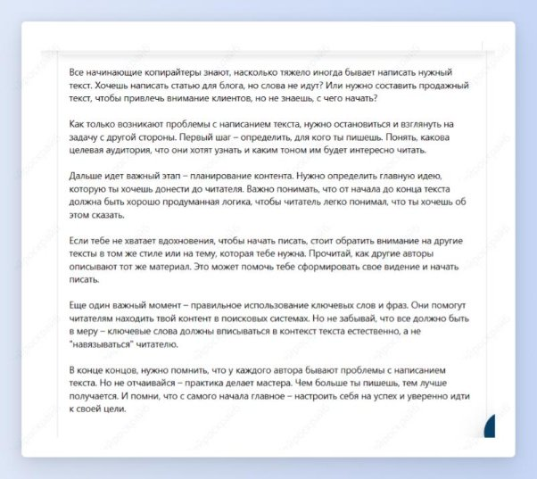

 ## Генератор историй

Шаг 1: выбери шаблон “Генератор историй”.

Шаг 2: укажи целевую аудиторию и опиши проблему или задачу.

Получи увлекательную подробную историю по заданному вопросу, которая идеально подойдет для поста или сториз.

