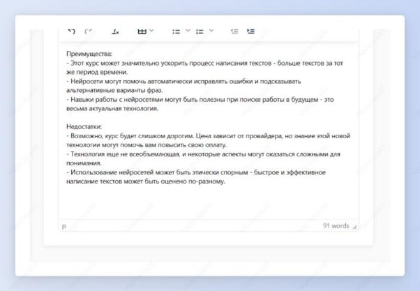

 ## Плюсы и минусы продукта

Шаг 1: выбери шаблон “Плюсы и минусы продукта”.

Шаг 2: опиши свой продукт и нажми кнопку “Создать”.

Получи достоинства своего продукта, которые нужно раскрывать в социальных сетях и на лендинге, а также недостатки - то есть самые частые возражения клиентов.

