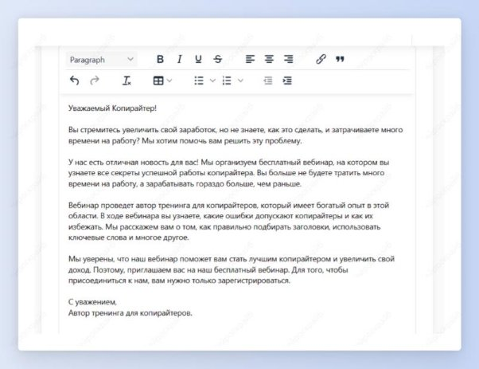

## Персональный email

Шаг 1: выбери шаблон “Персональный email”.

Шаг 2: укажи от кого письмо, кому предназначается, его цель и краткое описание, о чем оно. Нажми на кнопку “Создать”.

Получи персональное письмо для рассылки, которое точечно попадает под запросы ЦА.

