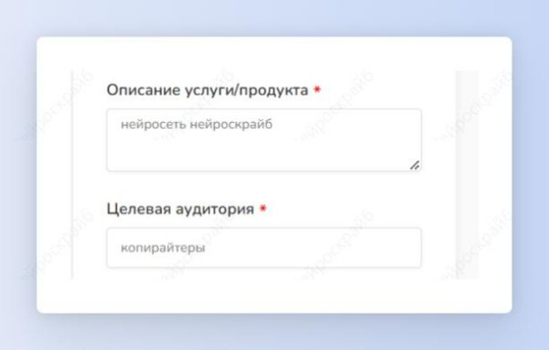
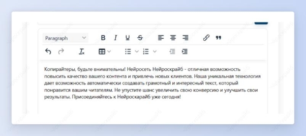

 ## Текст для увеличения конверсии

Шаг 1: выбери шаблон “Текст для увеличения конверсии” в разделе “Написание текстов”.

Шаг 2: опиши продукт/услугу и целевую аудиторию.

Получи текст, который повысит конверсию на сайте твоей услуги или продукта.

