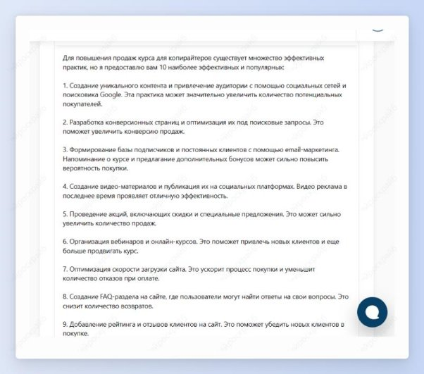

 ## Лучшие практики в нише для определенной цели
Шаг 1: выбери шаблон “Лучшие практики в нише”.

Шаг 2: укажи действие, которого необходимо достичь, и нишу. Нажми на кнопку “Создать”.

Получи самые эффективные практики для достижения поставленной цели в твоей нише.

