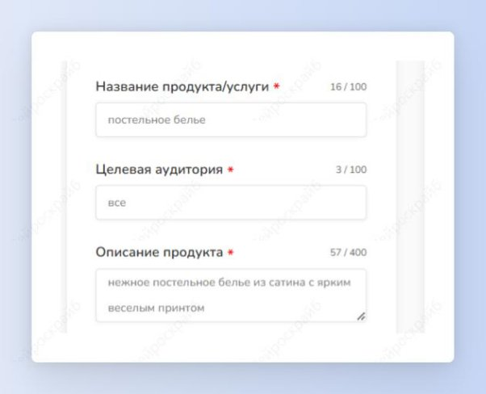
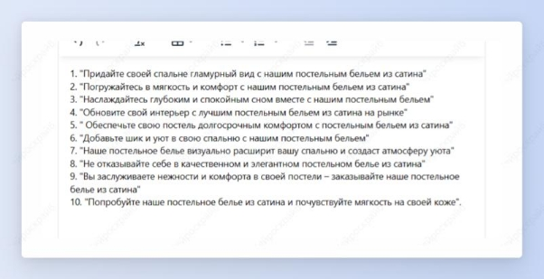
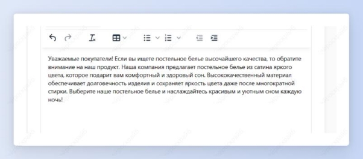

## Названия и описания продуктов в Ozon/Wildberries

Шаг 1: сначала создадим креативное название товара. Выбери шаблон “Название товара Ozon/Wildberries”.

Шаг 2: введи название продукта, его описание и целевую аудиторию и нажми на кнопку “Создать”.

Получи 10 продающих заголовков для описания своего продукта.

Шаг 3: теперь создадим описание товара. Выбери шаблон “Описание товара Ozon/Wildberries”.

Шаг 4: снова введи все необходимые описания товара (не забудь про ключевые слова) и целевой аудитории и нажми на кнопку “Создать”.

Получи емкое описание, в которое включены все заданные ключевые слова.

