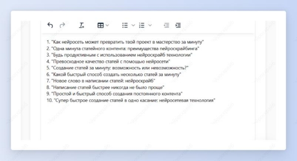
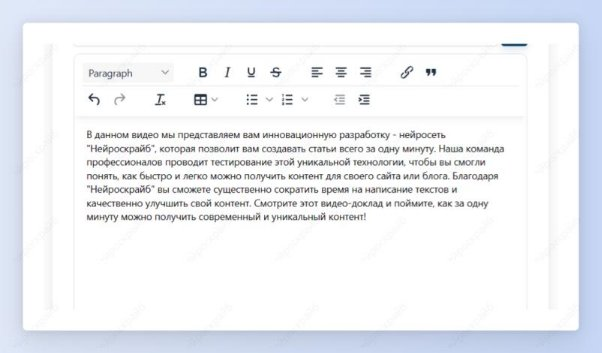

 ## Заголовки и описание YouTube-видео
Шаг 1: сначала создадим креативные заголовки. Выбери шаблон “Заголовки YouTube”.

Шаг 2: введи, о чем твое видео, и нажми кнопку “Создать”.

Получи 10 вариантов оригинальных заголовков для видео на YouTube, которые привлекут подписчиков.

Шаг 3: теперь создадим описание для твоего видео. Для этого выбери шаблон “Описание видео для YouTube”.

Шаг 4: снова введи информацию, о чем твое видео, и нажми на кнопку “Создать”. 

Получи подробное описание для видео, в котором отражено, о чем оно, что в нем интересного и почему пользователю нужно его посмотреть.

