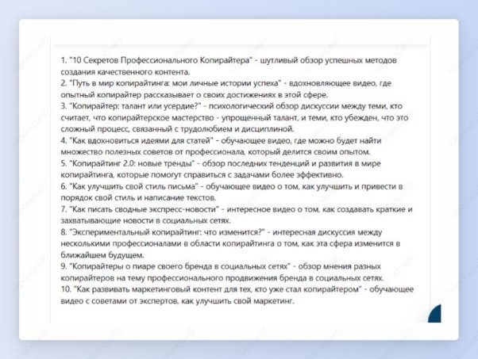
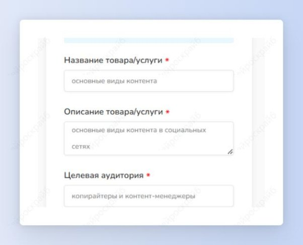
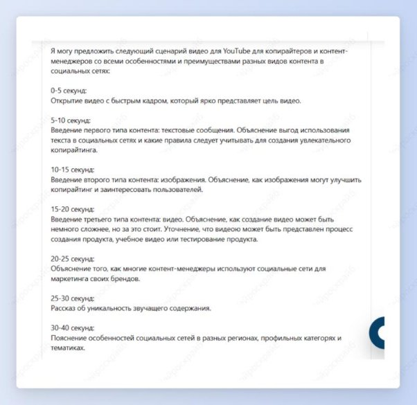

## Идеи для TikTok и YouTube

Шаг 1: выбери шаблон “Идеи TikTok” или “Сценарий видео YouTube”.

Шаг 2: если ты хочешь получить идеи для TikTok, то введи, о чем твой аккаунт.

Получи 10 идей, которые понравятся твоей аудитории. Скорее иди снимай. Кстати, идеи для TilTok также можно реализовать в Reels и в Shorts.

Если ты хочешь получить сценарий для YouTube, то напиши название видео, о чем оно и кто его ЦА.

Получи подробный сценарий твоего видео. Успешных съемок!

