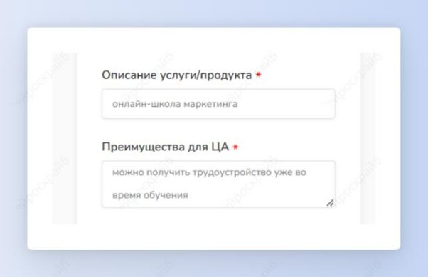
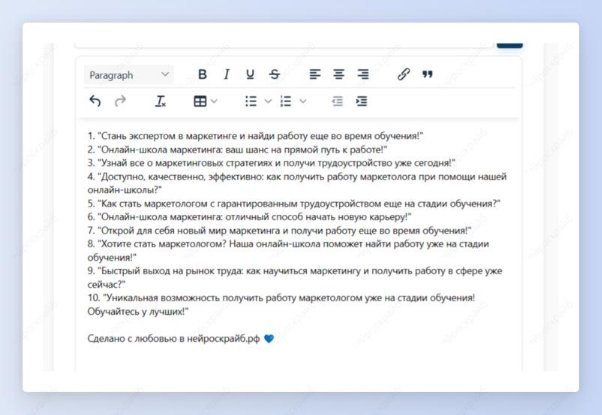

 ## Заголовки для лендинга
Шаг 1: выбери шаблон “Заголовки для лендинга” в разделе “Для сайта”.

Шаг 2: введи описание услуги или продукта и преимущества для целевой аудитории.

Получи 10 заголовков, которые зацепят пользователя еще на первой странице сайта.

