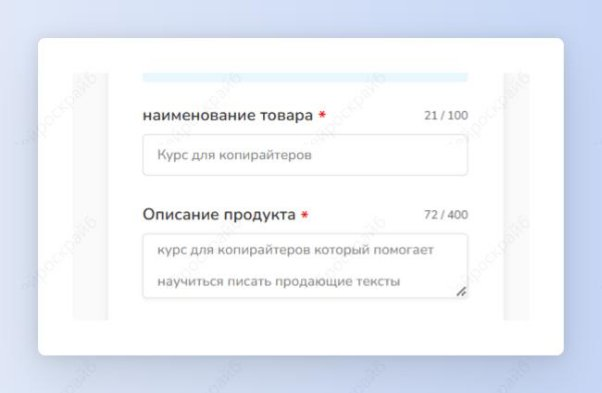
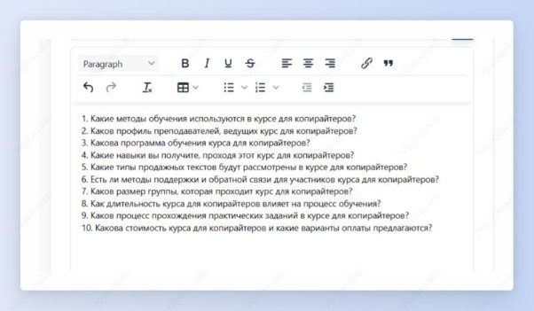
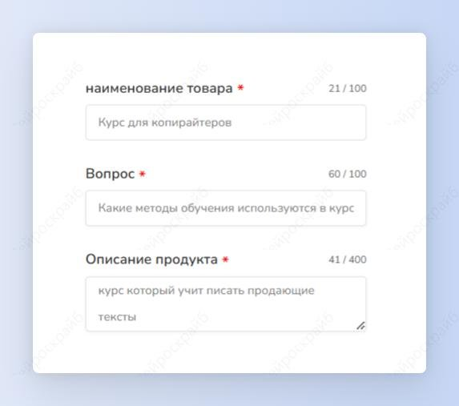

## FAQs и ответы на них

Шаг 1: сначала создадим сами FAQs. Выбери шаблон “Генератор FAQs”.

Шаг 2: напиши название и описание продукта. Нажми на кнопку “Создать”.

Получи 10 самых частых вопросов по заданному продукту.

Шаг 3: теперь напишем ответы на любой из FAQs. Выбери шаблон “Ответы для FAQs”.

Шаг 4: напиши название продукта и его описание и нужный вопрос. Нажми на кнопку “Создать”.

Получи 5 вариантов ответа на заданный вопрос. Повтори со всеми FAQs и будь счастлив!

