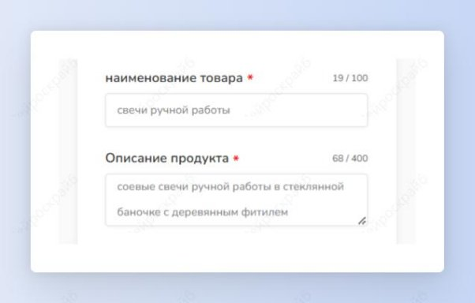

 ## Отзывы

Шаг 1: выбери шаблон “Отзывы” во вкладке “Другие”.

Шаг 2: введи название продукта и его описание. Нажми на кнопку “Создать”.

Получи несколько готовых отзывов для своей страницы в социальных сетях либо для продающего лендинга.

