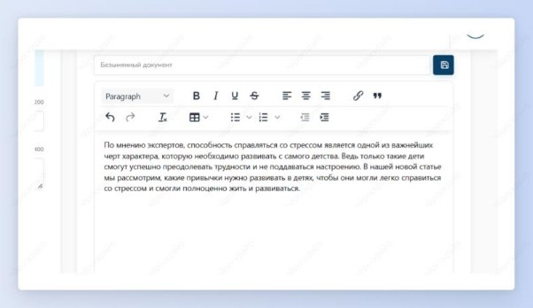
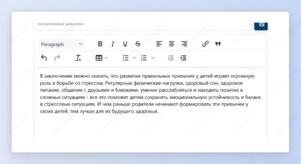

## Вступление и заключение для статьи

Шаг 1: сначала создай вступление для своей статьи. Выбери шаблон “Вступление для статьи”.

Шаг 2: введи название статьи и о чем она. Нажми на кнопку “Создать”.

Получи качественно вступление для статьи, которое заинтересовывает с самых первых слов. Сохрани его, нажав на “файлик” над готовым текстом.

Шаг 3: теперь создай заключение для статьи за пару шагов. Выбери шаблон “Заключение для статьи”.

Шаг 4: введи название статьи, о чем она и нажми на кнопку “Создать”.

Получи оригинальное заключение своей статьи.

