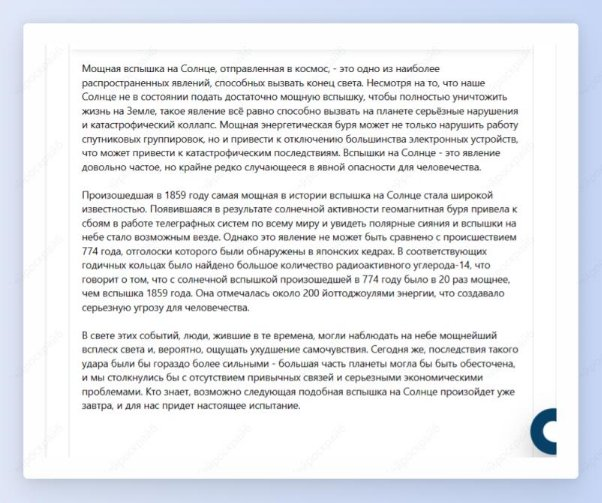
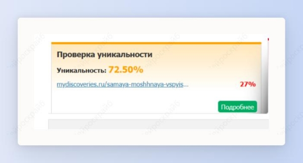
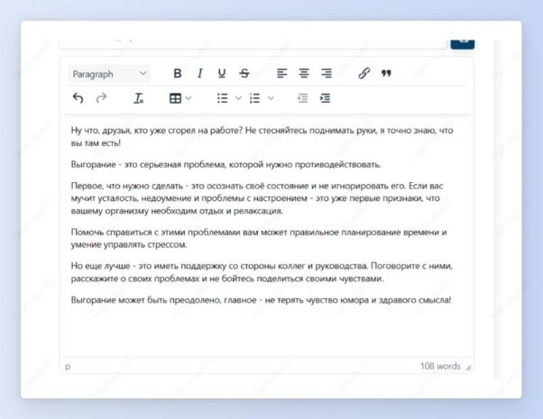

 ## Рерайт и перефразирование

Шаг 1: выбери шаблон “Рерайт статьи”.

Шаг 2: вставь в необходимое поле статью для рерайта и заполни ключевые слова.

Например, необходимо сделать рерайт статьи про самую мощную вспышку на Солнце [Самая мощная вспышка на Солнце в истории - Mydiscoveries.ru](https://mydiscoveries.ru/samaya-moshhnaya-vspyishka-na-solntse-v-istorii)

Для этого скопируй статью с сайта и вставь в нейроскрайб. Введи ключевые слова и нажми на кнопку “Создать”.

Получи вот такую статью.

Давай проверим ее уникальность.

Уникальность 72,5% - прекрасный результат!

Шаг 3: а теперь попробуй перефразировать контент. Для этого выбери шаблон “Перефразировать контент”.

Шаг 4: вставь нужную статью и выбери тон текста “Забавный” (можно выбрать любой тон текста).

Получи легкий и смешной текст на заданную тему.

