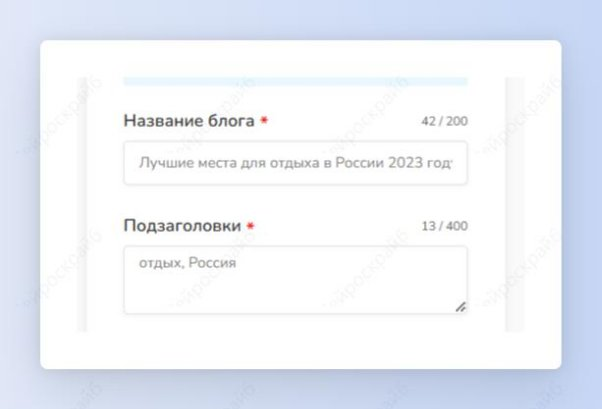
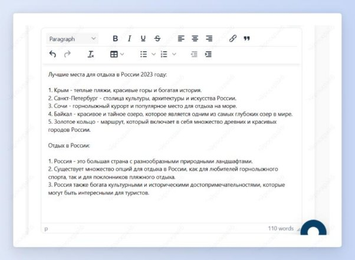

## Тезисы для статьи

Шаг 1: выбери шаблон “Тезисы для статьи”.

Шаг 2: введи название статьи и ключевые подзаголовки.

Получи отличные тезисы для статьи, благодаря которым ты быстрее выполнишь свою работу. 

