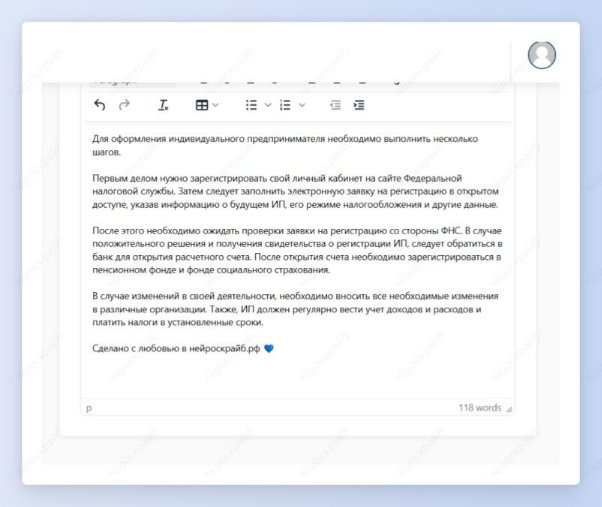

 ## Пошаговая инструкция

Шаг 1: выбери шаблон “Пошаговая инструкция”.

Шаг 2: введи тему инструкции и для чего она необходима. Нажми кнопку “Создать”.

Получи расписанную по шагам инструкцию с милой припиской от создателей нейроскрайба.

